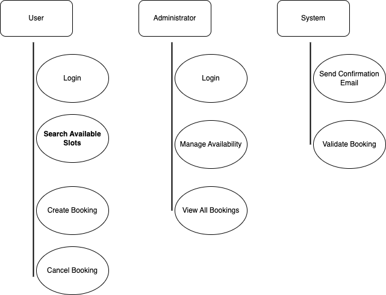

# Requirement Analysis in Software Development

This repository explores the process of **requirement analysis** in software development.  
It serves as a foundation for understanding how to gather, document, and manage software requirements effectively.  
You'll find structured insights, examples, and best practices to support planning and communication throughout the software development lifecycle.

## What is Requirement Analysis?

**Requirement Analysis** is a crucial phase in the Software Development Life Cycle (SDLC) where the needs and expectations of users, stakeholders, and the business are identified, gathered, analyzed, and documented.  
It helps define *what* a system should do rather than *how* it should do it.

This process ensures that all stakeholders have a clear understanding of the system requirements and helps prevent costly misunderstandings or changes later in development. It involves activities such as requirement elicitation, validation, documentation, and management.

### Importance in SDLC:
- Ensures the development team builds the right product.
- Helps in setting clear goals and scope.
- Reduces risk of project failure due to vague or misunderstood requirements.
- Improves communication between stakeholders and developers.
- Provides a baseline for testing and validation.

In short, effective requirement analysis lays the groundwork for a successful software project by aligning the technical solution with user needs and business objectives.

## Why is Requirement Analysis Important?

Requirement Analysis plays a vital role in the success of any software project. It helps ensure that the final product meets the expectations of users and stakeholders. Here are three key reasons why it is critical in the Software Development Life Cycle (SDLC):

1. **Prevents Miscommunication and Misunderstanding**  
   Clear and well-documented requirements reduce the risk of ambiguity between stakeholders, developers, and testers. This ensures that everyone is on the same page from the beginning.

2. **Improves Project Planning and Estimation**  
   A thorough analysis of requirements helps project managers make better decisions around timeframes, resources, budgeting, and technology choices. This leads to more accurate project planning.

3. **Reduces Rework and Project Costs**  
   Identifying and addressing requirements early in the process helps catch issues before development begins. This minimizes costly revisions, delays, and changes later in the project lifecycle.

Requirement Analysis not only defines what the software should do but also aligns development efforts with business goals, making it a cornerstone of effective software engineering.

## Key Activities in Requirement Analysis

The process of Requirement Analysis involves several key activities that ensure all stakeholder needs are understood, documented, and validated. These steps help translate business needs into clear and actionable software requirements.

- **Requirement Gathering**  
  This is the initial step where information is collected from stakeholders, users, clients, and other sources to understand their needs and expectations for the system.

- **Requirement Elicitation**  
  Involves active techniques such as interviews, workshops, brainstorming sessions, surveys, and observations to draw out requirements that stakeholders might not explicitly state.

- **Requirement Documentation**  
  All collected and elicited requirements are formally documented in a clear, structured format—often in a Software Requirements Specification (SRS) document—for future reference and agreement.

- **Requirement Analysis and Modeling**  
  The documented requirements are analyzed to check for completeness, consistency, feasibility, and clarity. Modeling tools like use case diagrams, data flow diagrams (DFDs), and UML may be used to represent the requirements visually.

- **Requirement Validation**  
  The final step ensures that the documented requirements accurately reflect stakeholder needs. This is usually done through reviews, walkthroughs, and prototyping to confirm the requirements are correct and achievable.

## Types of Requirements

In software development, requirements are typically categorized into two main types: **Functional Requirements** and **Non-functional Requirements**. Both are essential for building a complete and effective system.

### Functional Requirements

Functional requirements define the specific behaviors, features, and functions of a system—essentially, what the system should do.

**Definition:**  
These are the core operations and services the system must perform in response to user input or system events.

**Examples for a Booking Management System:**
- Users must be able to create, view, update, and cancel bookings.
- The system should allow users to search available slots by date and time.
- Administrators can manage booking slots and set availability.
- The system should send confirmation emails after a successful booking.
- The application must support user login and role-based access.

### Non-functional Requirements

Non-functional requirements specify *how* the system performs its functions. They define the quality attributes and constraints of the system.

**Definition:**  
These requirements relate to performance, security, usability, scalability, reliability, and other operational aspects.

**Examples for a Booking Management System:**
- The system should be able to handle at least 1,000 concurrent users.
- Booking confirmation emails should be sent within 30 seconds.
- The application must comply with data privacy regulations (e.g., GDPR).
- System uptime should be at least 99.9% over a 30-day period.
- The user interface should be mobile-responsive and accessible.

Both types of requirements are critical to ensure the software meets business goals, user expectations, and technical standards.

## Use Case Diagrams

**Use Case Diagrams** are visual representations that describe how users (actors) interact with a system. They are a part of the Unified Modeling Language (UML) and help illustrate the system's functionality from the user's perspective.

### Benefits of Use Case Diagrams:
- Provide a clear overview of system functionalities.
- Help identify user interactions early in the development process.
- Simplify communication between stakeholders and developers.
- Serve as a foundation for writing detailed use cases and test cases.

Below is the use case diagram for the **Booking Management System**, which includes major actors and their interactions with the system:

**Key Actors:**
- **User:** Can search for slots, create bookings, cancel bookings.
- **Administrator:** Can manage availability, view bookings, and modify system settings.
- **System:** Sends email notifications and verifies user login.

**Key Use Cases:**
- Search available booking slots
- Create a booking
- Cancel a booking
- Receive confirmation emails
- Manage slot availability
